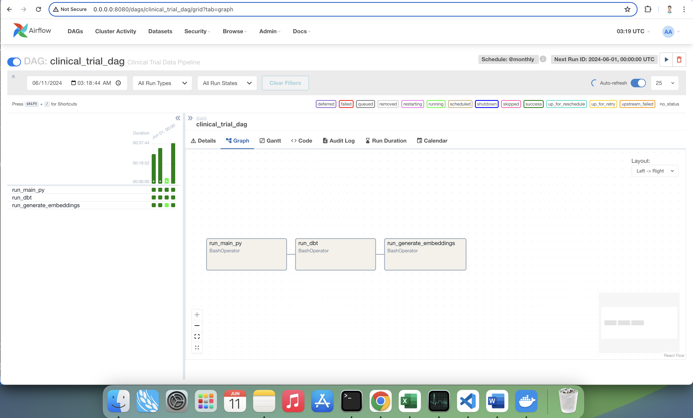
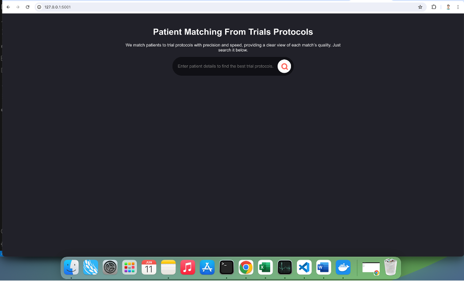
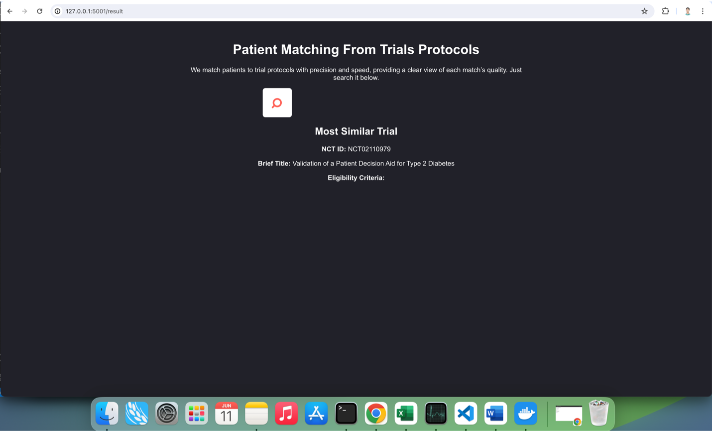

# Clinical Trial Data Pipeline

This project provides a comprehensive data pipeline for clinical trial data, leveraging tools like Apache Airflow, DBT, DuckDB, and Flask and HuggingFace Models. The pipeline processes clinical trial data, generates embeddings, and serves a web application for patient-to-trial matching.

## Table of Contents

- [Prerequisites](#prerequisites)
- [Installation](#installation)
- [Usage](#usage)
- [Models/AI Involved](#models-involve)


## Prerequisites

Before you begin, ensure you have met the following requirements:

- Docker
- Docker Compose
- Git

## Installation

1. **Clone the repository**:

   ```sh
   git clone https://github.com/grp-dalida-data/clinical_trial_data_pipeline.git
   cd clinical_trial_data_pipeline
   ```

2. **Set up environment variables:**:

```sh
DUCKDB_PATH=/opt/airflow/src/data/clinical_trial_data.duckdb
OPENAI_API_KEY=<api_key>
```

3. **Build and start the Docker containers**:

```sh
docker-compose build
docker-compose up

```

Usage

Access the Airflow UI:

Open your browser and navigate to http://localhost:8080 to access the Airflow webserver.

Trigger the DAG:

The DAG is scheduled to run monthly. You can manually trigger it via the Airflow UI.
The DAG executes the following steps:
Run main.py to process the data.
Run DBT models to transform the data.
Run generate_embeddings_and_load.py to generate and load embeddings.
Access the Flask web application:

Open your browser and navigate to http://localhost:5001 to access the Flask web application for patient-to-trial matching.

## Models Involve
This project uses the following models for ML/AI Applications:

- GPT-3.5 or <a href="https://huggingface.co/Clinical-AI-Apollo/Medical-NER" target="_blank">Clinical-AI-Apollo/Medical-NER</a> from hugging face

For Entity Recognition of Diseases and Medications
- <a href="https://huggingface.co/sentence-transformers/all-MiniLM-L6-v2" target="_blank">all-MiniLM-L6-v2</a>

This is for embeddings/transformers that was used for patient matching.

## Some Screenshots
**Airflow DAG for Running the DLT, DBT and Generating Embeddings**


**Patient Matching Flask App**
- Home Page


- Result Page

